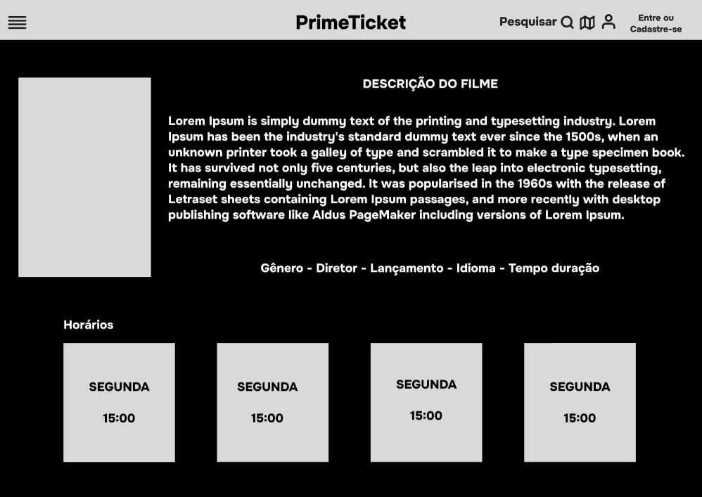
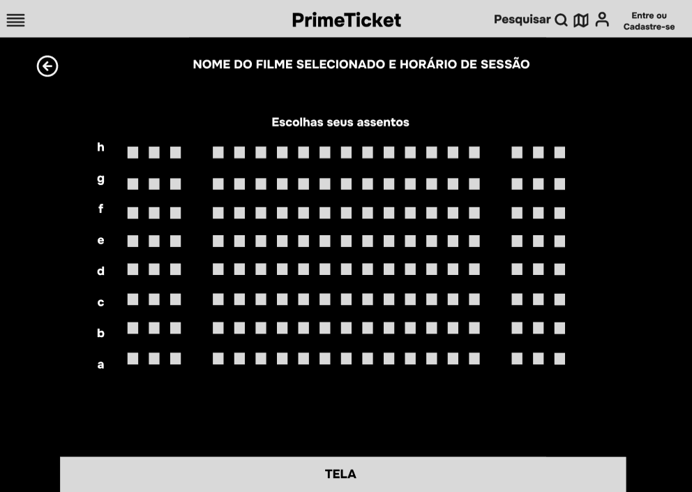
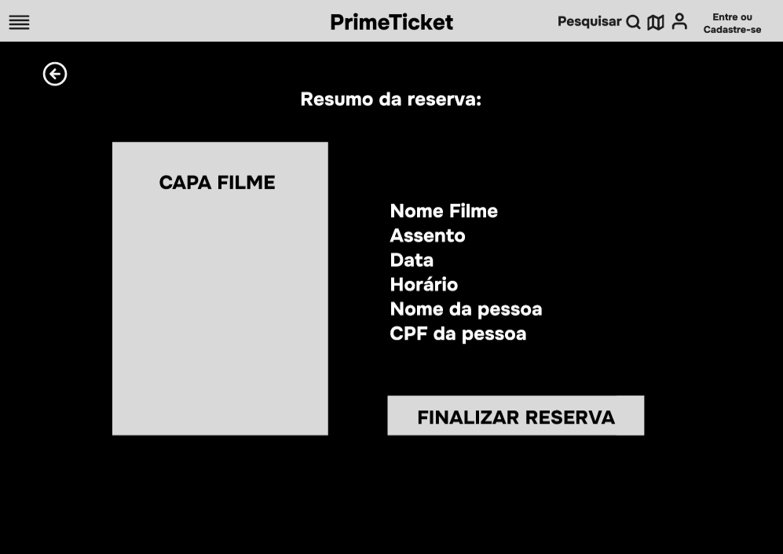
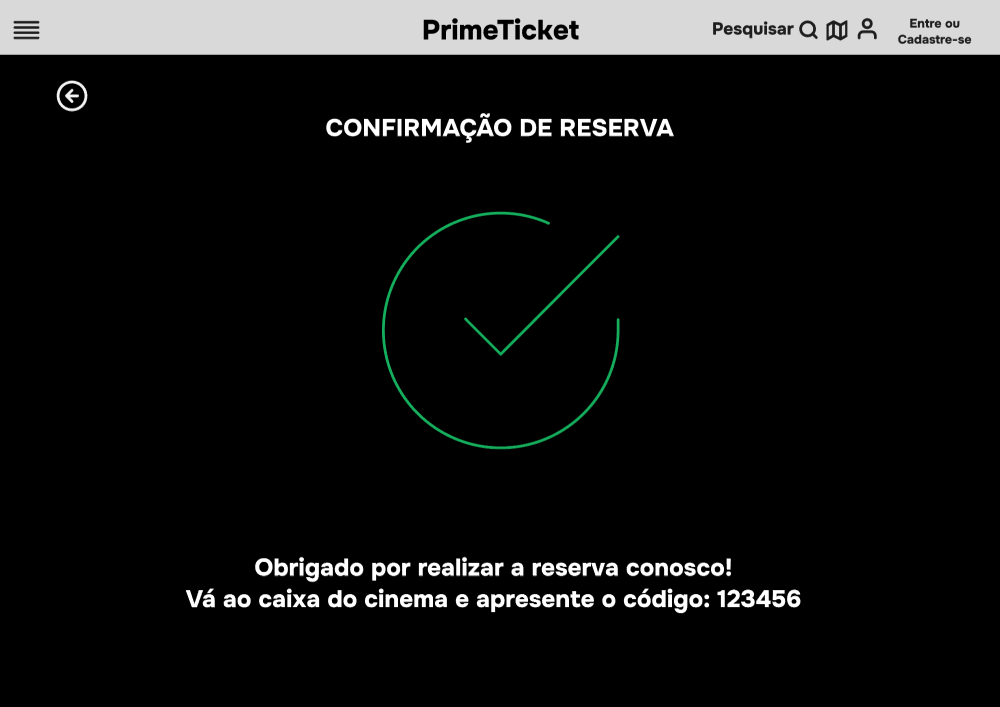
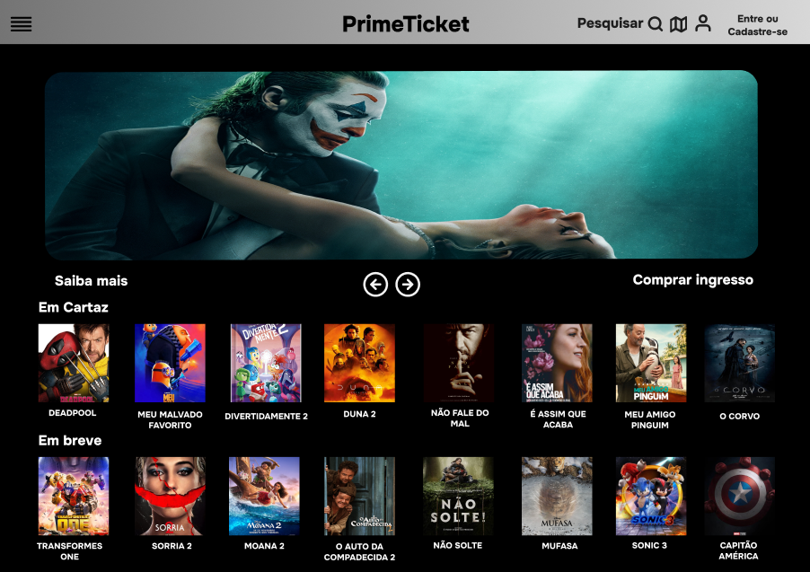
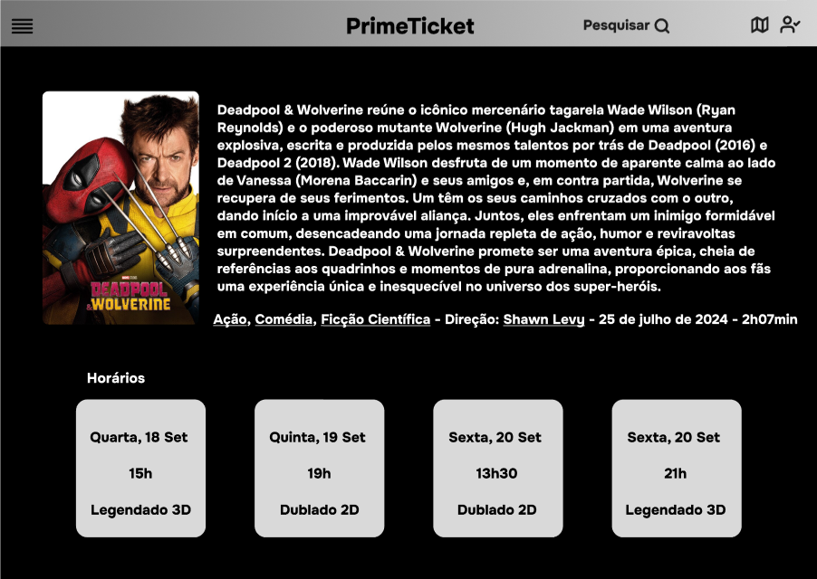
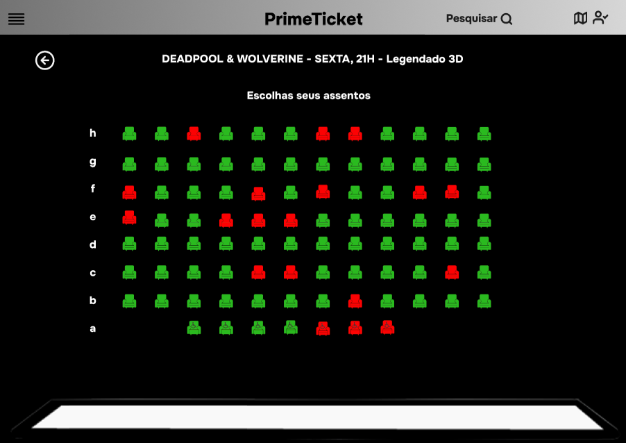
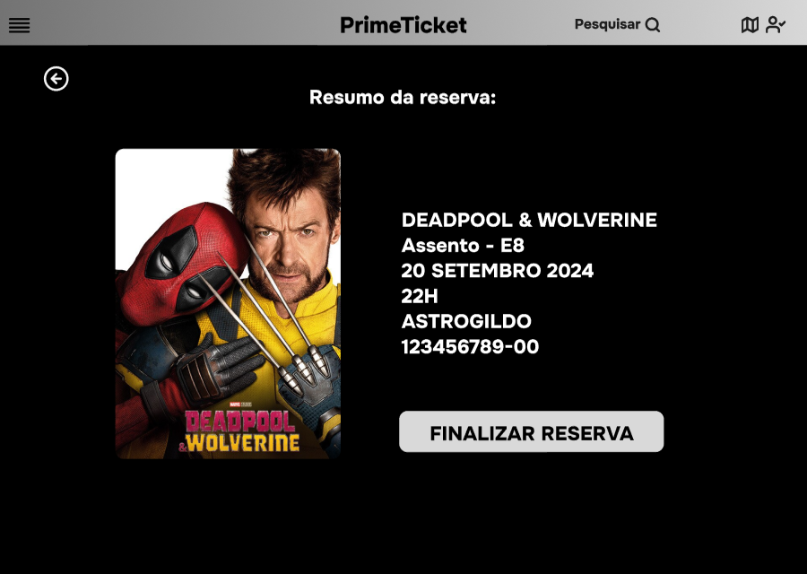
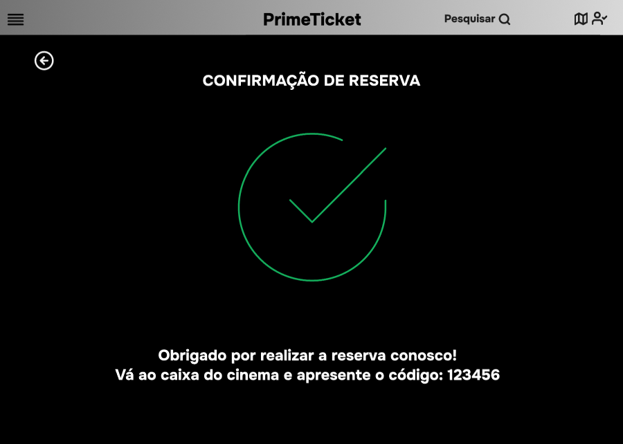
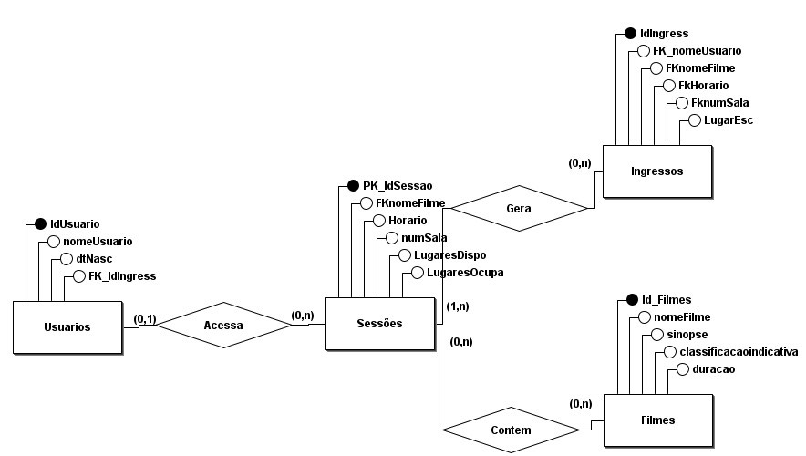

PROJETO: RESERVA DE INGRESSOS CINEMA

RESUMO: 

Nosso projeto visa criar uma plataforma intuitiva e eficiente para a reserva de ingressos de cinema,
oferecendo aos usuários uma experiência fluida e agradável na busca por filmes, sessões e horários.
A plataforma será projetada para facilitar a escolha e a reserva de assentos, garantindo uma
experiência do usuário otimizada e moderna.
 

DETALHAMENTO DO PROJETO:

- PÁGINA INICIAL 

FILME PRINCIPAL EM DESTAQUE:

- Exibição do filme em destaque com sinopse e trailer.

FILMES EM CARTAZ:

- Lista de filmes atualmente em cartaz, com pôster e título.
- Cada item será clicável e levará à página de detalhes do filme.

FILMES EM BREVE:

- Lista de filmes que estão para estrear, com pôster e título.

MENU SUPERIOR:

- Login/Perfil: Acesso ao perfil do usuário ou opção de login/registro.
- Pesquisa: Barra de pesquisa para encontrar filmes específicos.
- Filtros: Opções de filtro por gênero, data, horário, etc.
- Histórico de Reservas: Seção onde o usuário pode visualizar e gerenciar suas reservas anteriores.

PROCESSO DA RESERVA

ESCOLHA SESSÃO:

- Usuário escolhe uma sessão da lista apresentada.

LOGIN:

- Se o Usuário Não Estiver Logado:
- Redirecionamento para a página de login/registro.

- Se o Usuário Estiver Logado:
- Acesso direto à seleção de assentos.

SELEÇÃO DE ASSENTOS:

- Interface gráfica para a escolha de assentos disponíveis na sala.
- Exibição em tempo real da disponibilidade dos assentos.

CONFIRMAÇÃO DE RESERVA:

- Resumo da reserva com detalhes do filme, sessão, assentos selecionados e valor.
- Opção de revisar e confirmar a reserva.

CONCLUSÃO DA RESERVA:

- Atualização em tempo real da disponibilidade dos assentos para refletir a nova reserva.

HISTÓRICO DE RESERVAS

VISUALIZAÇÃO:

- Seção acessível através do menu superior.
- Listagem de todas as reservas anteriores do usuário com detalhes como filme, data, horário e assentos.

GERENCIAMENTO:

- Opção para visualizar e, se necessário, cancelar reservas.
- visualização dos ingressos eletrônicos anteriores.

 ## Baixo Nivel

 ## Alto Nivel

 ## MER

 
